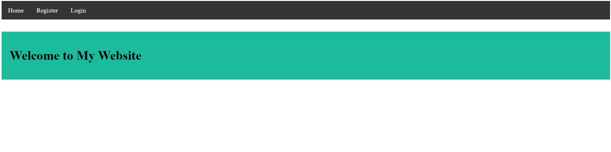
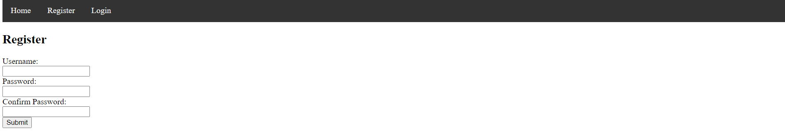
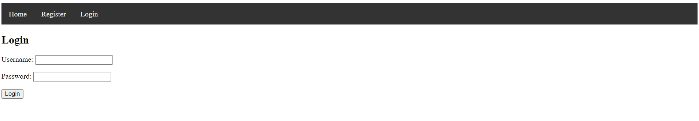

# User Database Web App
This template demonstrates how to create a user database for a web app with django. The web app has three pages, a home, register, and login page. Here is what each page looks like. 





To run the app, in bash, run 

```bash
python manage.py makemigrations
python manage.py migrate
python manage.py runserver
```

### App Structure
The frontend html is stored in the [templates](templates/users) folder. These are connected to [views.py](users/views.py), which will import the django user model and connect it to the login and registration forms in html. The views for each page are then given urls in [urls.py](users/urls.py). 

Django automatically connects the app to a sqlite database that can be found at [db.sqlite3](db.sqlite3).

### Reminders
Add your app in the INSTALLED_APPS at [settings.py](user_database_web_app/settings.py) and add your app urls to the project level [urls.py](user_database_web_app/urls.py).

### Deploying your app
To see the deployment of this app, click [here](https://liamjdavis.pythonanywhere.com/login/). Python Anywhere has a free tier that will host your app. To host your app, navigate [here](https://www.pythonanywhere.com/user/liamjdavis/), make an account, then follow [these](https://help.pythonanywhere.com/pages/DeployExistingDjangoProject/) instructions. Contact us with any issues you might have.